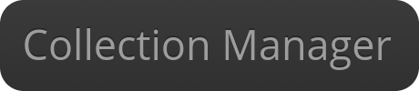

=

# This project is under development

Collection Manager is a software (website) intended to manage strains in microbiological laboratories,
it provides the management of:
* GMO strains
* Wild strains
* Plasmids
* Primers
 
 ##How to install to develop the app (no adapted for production) ?
 
 Install nginx, PHP, MariaDb, ElasticSearch through docker:
 
    docker-compose build
    docker-compose create
    docker-compose start
    
 Enter in the docker container to execute commands:
 
     docker exec -it CONTAINER_NAME bash
 
 Once you're in the container, execute this commands:
 
     composer install
     bin/console doctrine:schema:update --force
     bin/console assetic:dump
     bin/console cache:clear
 
 Now, you can start to work on the app.
